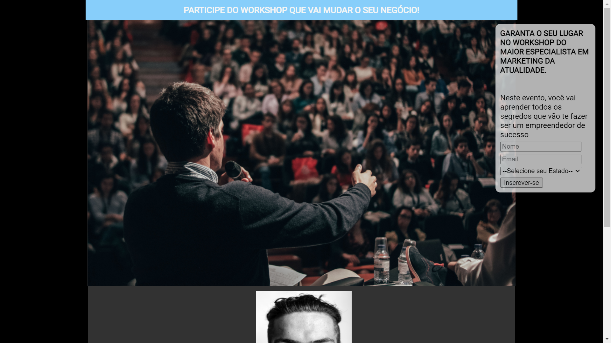
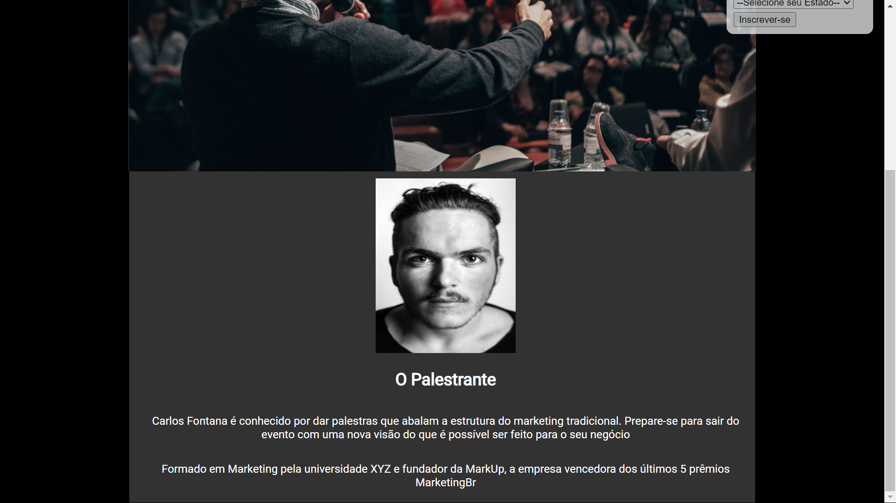

# PaginaDeCaptura
Projeto de uma página de captura para um Workshop. Feito em HTML e CSS. 
 
Os créditos das imagens vão para o curso ProgramadorBr no qual o produtor Igor Oliveira disponibilizou as imagens.
 

Você pode acessar o site clicando <a href="https://guilherme-landing-page-design.netlify.app/" target="_blank">aqui</a>.
